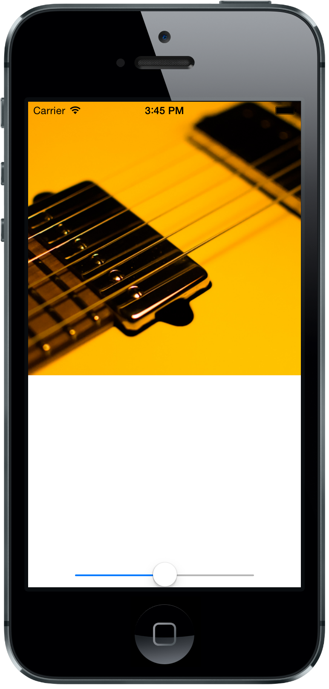
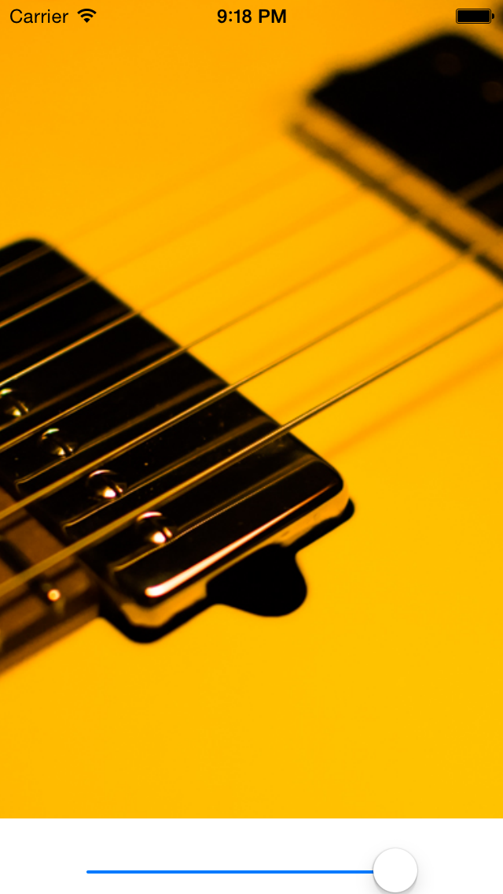

CPKenburnsImageView
===================
### Ken Burns Effect

inspired by Heyday 

## Enable slideshow!

[CPKenburnsSlideshowView](https://github.com/muukii0803/CPKenburnsSlideshowView)

---- 
```
pod 'CPKenburnsView'
```
#### [SampleMovie](http://f.cl.ly/items/3R0n3x291924413z1Y44/sampleMovie.mp4)

#### Screen shots




### How to use
#### Example

```Objective-C
    CPKenburnsView *kenburnsView = [[CPKenburnsView alloc] initWithFrame:CGRectMake(0, 0, 320, 320)];
    kenburnsView.image = [UIImage imageNamed:@"2.png"];
    [self.view addSubview:kenbunrsView];
```

#### Options

```Objective-C
typedef NS_ENUM(NSInteger, CPKenburnsImageViewZoomCourse) {
    CPKenburnsImageViewZoomCourseRandom                = 0,
    CPKenburnsImageViewZoomCourseUpperLeftToLowerRight = 1,
    CPKenburnsImageViewZoomCourseUpperRightToLowerLeft = 2,
    CPKenburnsImageViewZoomCourseLowerLeftToUpperRight = 3,
    CPKenburnsImageViewZoomCourseLowerRightToUpperLeft = 4
};
```

```Objective-C
@interface CPKenburnsView : UIView
@property (nonatomic, copy) UIImage * image;
@property (nonatomic, assign) CGFloat animationDuration;  //default is 13.f
@property (nonatomic, assign) CGFloat zoomRatio; // default 0.1  0 ~ 1
@property (nonatomic, assign) CGFloat endZoomRate; // default 1.2
@property (nonatomic, assign) CGFloat startZoomRate; // default 1.3
@property (nonatomic, assign) CPKenburnsImageViewZoomCourse course; // default is 0

- (void)restartMotion;
@end
```
